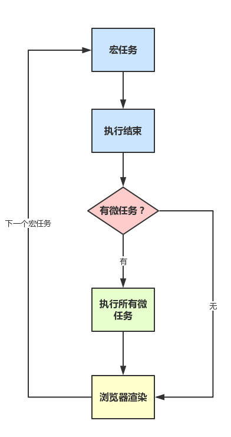

### 进程与线程

1. 进程： CPU 在**运行指令及加载和保存上下文所需的时间**，可以理解为执行一个程序。

2. 线程：是进程中更小的单位，描述执行一段指令需要的时间。

   eg：当你打开一个 Tab 页时，其实就是创建了一个进程，一个进程中可以有多个线程，比如渲染线程、JS 引擎线程、HTTP 请求线程等等。当你发起一个请求时，其实就是创建了一个线程，当请求结束后，该线程可能就会被销毁。

3. 单线程：同一时间只能做一件事。**JS是单线程运行**。

4. JS单线程运行的原因：避免渲染DOM冲突。（如果能同时执行两段JS，并且是对同一个DOM进行操作，难么就难免冲突）。

5. 解决方案：异步。

6. 实现方式：Event Loop

### Event Loop（浏览器）

1. 什么是EventLoop：事件循环，JS实现异步的解决方案。

2. 执行顺序：先执行同步代码，也就是在执行栈中放入函数。有异步函数时，按顺序把异步函数放在队列中，待同步函数执行完，轮询执行异步队列的函数。（也可以理解当执行栈为空了，Event Loop 就会从异步队列中拿出需要执行的代码放入执行栈中，本质上来说，JS中的异步还是同步行为）

   - 首先执行同步代码，属于宏任务。

   - 当执行完所有同步代码后，执行栈为空，查询是否有异步代码需要执行。

   - 执行所有的微任务。

   - 执行完所有微任务后，如有必要会渲染页面。

   - 进行下一轮的Event Loop，执行宏任务中的异步代码，也就是setTimeout中的回调函数。

     **宏任务 => 微任务 => 宏任务的异步代码**

     

3. 在异步队列中任务源的区分：

   - [ ] **微任务**（microtask），在ES6规范中称为**jobs**
   - [ ] **宏任务**（macrotask），在ES6规范中称为**task**

4. **微任务包含**：`Promise`，`process.nextTick`(Node独有)

5. **宏任务包含**：`script`，`setTimeout`，`setInterval`，`setImmediate` 

​	

### Event Loop（Node.js）

1. setImmediate，setTimeout/setInterval，nextTick的执行顺序

   ```js
   setImmediate(_=>{
       console.log('setImmediate')
   })
   
   setTimeout(_=>{
        console.log('setTimeout')
   },0)
   
   process.nextTick(_=>{
        console.log('process.nextTick')
   })
   
   // 执行顺序是 nextTick immediate timeOut
   ```

### 常见题型整理 

```js
console.log('script start')

async function async1() {
  await async2()
  console.log('async1 end')
}
async function async2() {
  console.log('async2 end')
}
async1()

setTimeout(function() {
  console.log('setTimeout')
}, 0)

new Promise(resolve => {
  console.log('Promise')
  resolve()
})
  .then(function() {
    console.log('promise1')
  })
  .then(function() {
    console.log('promise2')
  })

console.log('script end')
// script start -> async2 end -> Promise -> script end -> async1 end -> promise1 -> promise2 -> setTimeout
```


```js
async function async1() {
    console.log('async1 start');
    await async2();
    console.log('async1 end');
}
async function async2() {
    console.log('async2');
}
console.log('script start');
setTimeout(function() {
    console.log('setTimeout');
}, 0)
async1();
new Promise(function(resolve) {
    console.log('promise1');
    resolve();
}).then(function() {
    console.log('promise2');
});
console.log('script end');
// script start -> async1 start -> async2 -> promise1 -> script end -> async1 end -> promise2 -> setTimeout
```


```js
async function async1() {
    console.log('async1 start');
    await async2();
    console.log('async1 end');
}
async function async2() {
    //async2做出如下更改：
    new Promise(function(resolve) {
    console.log('promise1');
    resolve();
}).then(function() {
    console.log('promise2');
    });
}
console.log('script start');

setTimeout(function() {
    console.log('setTimeout');
}, 0)
async1();

new Promise(function(resolve) {
    console.log('promise3');
    resolve();
}).then(function() {
    console.log('promise4');
});

console.log('script end');
// script start -> async1 start -> promise1 -> promise3 -> script end -> promise2 -> async1 end -> promise4 -> setTimeout
```


```js
async function async1() {
    console.log('async1 start');
    await async2();
    //更改如下：
    setTimeout(function() {
        console.log('setTimeout1')
    },0)
}
async function async2() {
    //更改如下：
	setTimeout(function() {
		console.log('setTimeout2')
	},0)
}
console.log('script start');

setTimeout(function() {
    console.log('setTimeout3');
}, 0)
async1();

new Promise(function(resolve) {
    console.log('promise1');
    resolve();
}).then(function() {
    console.log('promise2');
});
console.log('script end');
// 核心：在微任务中加入宏任务的异步代码时，还是优先promise。并且按setTimeout的顺序排列。
// script start -> async1 start -> promise1 -> script end -> promise2 -> setTimeout3 -> setTimeout2  -> setTimeout1
```


```js
async function a1 () {
    console.log('a1 start')
    await a2()
    console.log('a1 end')
}
async function a2 () {
    console.log('a2')
}

console.log('script start')

setTimeout(() => {
    console.log('setTimeout')
}, 0)

Promise.resolve().then(() => {
    console.log('promise1')
})

a1()

let promise2 = new Promise((resolve) => {
    resolve('promise2.then')
    console.log('promise2')
})

promise2.then((res) => {
    console.log(res)
    Promise.resolve().then(() => {
        console.log('promise3')
    })
})
console.log('script end')
// 注意 promise1的打印是优先于a1()，所以promise1会先被推入到队列。
// script start -> a1 start -> a2 -> promise2 -> script end -> promise1 -> a1 end -> promise2.then -> promise3 -> setTimeout
```

