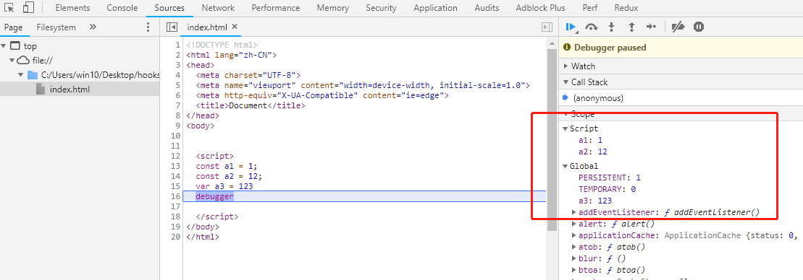

**变量提升**

1. 虽然变量还没有被声明，但是可以使用这个没有被声明的变量，这种情况就是提升。遇到var的作用域，**在任何语句执行之前就已经完成了声明和初始化**。也就是变量提升而且拿到undefined的原因由来。

   ```js
   console.log(a) // undefined
   var a = 10
   ```

2. 函数也有类似的提升。

   ```js
   console.log(a)// f a() {}
   var a = function(){}
   var a = 1
   ```

   可以看出**函数的提升优先于变量**

3. let const

   ```js
   var a = 1
   let b = 1
   const c = 1
   console.log(window.b) // undefined
   console.log(window. c) // undefined
   
   function test(){
     console.log(a)
     let a
   }
   test() // VM84:8 Uncaught ReferenceError: Cannot access 'a' before initialization
          // at test (<anonymous>:8:15)
          // at <anonymous>:11:1
   ```

   - var定义的会被挂载到window，而const与let的定义是不会的。

   - let，解析器进入一个块级作用域，发现let关键字,变量**只是先声明**，而并未到**初始化**那一步。所以在此作用域之前提前访问，则报错未定义，这就是暂时性死区的由来。等到解析到有let那一行的时候，才会进入**初始化**阶段。如果let的那一行是赋值操作，则初始化和赋值同时进行。

   - const与class与let同理。const与let声明了的变量不能再次被声明。

   - ```
     let只是创建过程提升，初始化过程并没有提升，所以会产生暂时性死区。
     var的创建和初始化过程都提升了，所以在赋值前访问会得到undefined
     function 的创建、初始化、赋值都被提升了
     ```

   #### 已经知道var创建的变量会被挂载到window下，那么let与const创建的变量呢？

   ```js
   var a = 12;
   function f(){};
   
   console.log(window.a); // 12
   console.log(window.f); // f(){}
   ```

   ```js
   let aa = 1;
   const bb = 2;
   
   console.log(window.aa); // undefined
   console.log(window.bb); // undefined
   ```

   

   可以看到 let 和 const 声明的全局变量并没有在全局对象中，只是一个块级作用域（Script）中

   获取方式：不加window（global）即可

   ```js
   let aa = 1;
   const bb = 2;
   
   console.log(aa); // 1
   console.log(bb); // 2
   ```

   const创建的一般是不可修改，只能修改const定义的是对象并只是修改对象的属性。